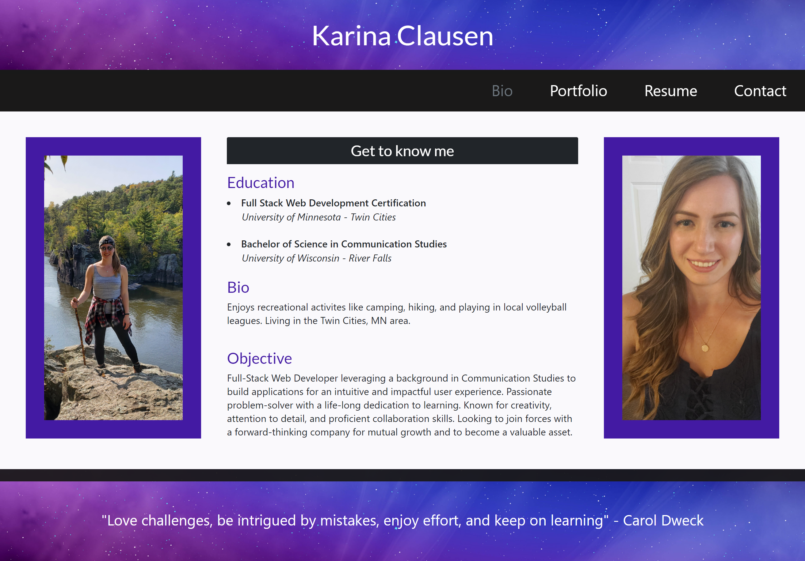

# React Portfolio
 &nbsp;&nbsp;&nbsp;&nbsp; &nbsp;&nbsp;&nbsp;&nbsp; &nbsp;&nbsp;&nbsp;&nbsp;

## :memo: Description
  This is a portfolio to showcase my the technologies I have learned, the projects I have created, and general information about myself for potential employers.

## :trophy: Table of Contents
* [Usage](#usage)
* [Contributing](#contributing)
  
  
## Usage
Giving potential employers my information and showcase my abilites & projects. 

Launch Github deployed web application [here](https://karina5151.github.io/React-Portfolio/)

  
## Contributing
This application was developed by Karina Clausen.

The technologies that made this possible are:
* HTML
* CSS
* <a href="https://www.javascript.com/" target="_blank">JavaScript</a>
* <a href="https://nodejs.org/api/fs.html" target="_blank">Node.js</a>
* <a href="https://expressjs.com/" target="_blank">Express.js</a>
* <a href="https://www.json.org/json-en.html" target="_blank">JSON</a>
* <a href="https://getbootstrap.com/" target="_blank">Bootstrap</a>
* <a href="https://reactjs.org/" target="_blank">React</a>

  
  
 ---

## :question: Questions

For any questions, please contact me using the information below:

:octocat: GitHub: [@Karina5151](https://github.com/Karina5151)

:envelope: Email: karina.clausen.11@gmail.com
